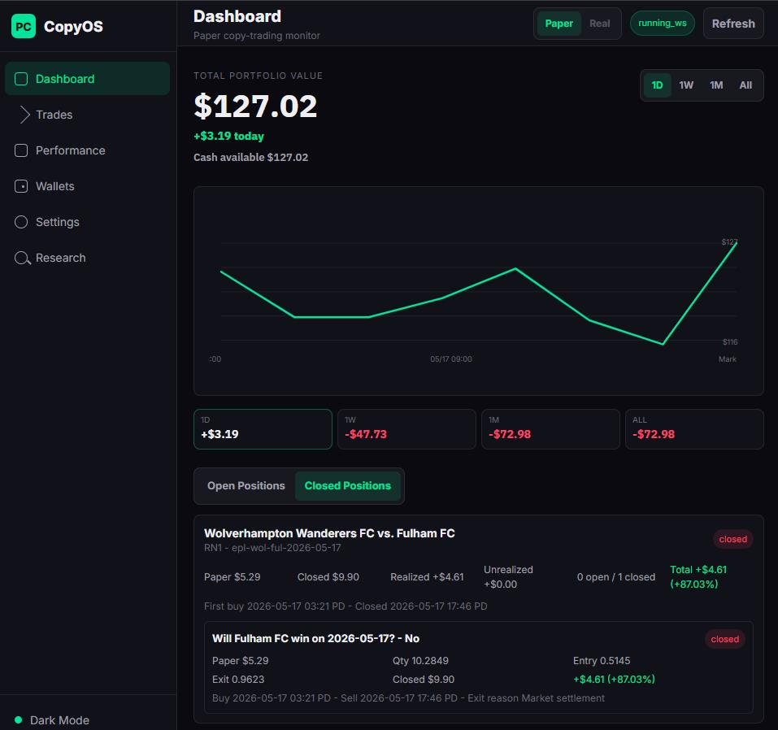
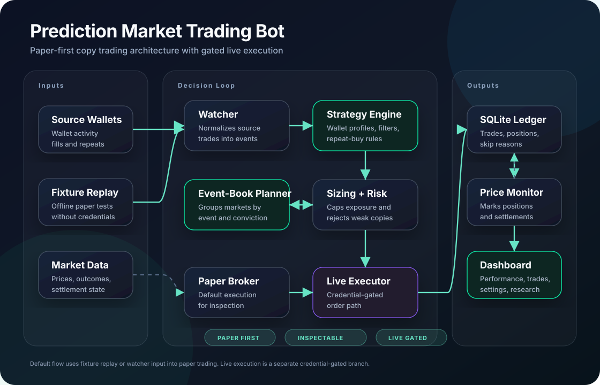

# Prediction Market Trading Bot

<p>
  <a href="https://github.com/galvinlam/prediction-market-trading-bot" target="_blank" rel="noopener">
    GitHub Repository
  </a>
</p>

A local-first Polymarket copy-trading prototype. It watches configured source wallets, classifies trades, applies copy rules, plans paper or live order intents, and shows portfolio state in a mobile-friendly dashboard.

The project started as a way to test whether a small account could follow stronger prediction-market wallets without blindly copying every fill. The interesting part is the decision layer: filters, event-book planning, sizing rules, stop logic, and a paper ledger that makes each decision inspectable before real execution.



## What It Demonstrates

- Paper-first copy trading with fixture replay and SQLite state.
- Wallet strategy profiles for source-follow, repeat-buy, event-follow, filter-copy, and event-book planning.
- A dashboard for positions, trades, performance, wallets, settings, and research notes.
- Market metadata and price monitoring for paper valuation and settlement handling.
- A live-execution path that is intentionally gated behind explicit live mode and credentials.
- A backtest script for replaying source-wallet activity against the event-book planner.
- Tests covering sizing, config loading, wallet profiles, paper ledger behavior, filtering, dashboard routes, market data, and execution-service safety.

## Architecture



## Run A Local Paper Demo

```powershell
python -m pip install -r requirements.txt
Copy-Item config.example.yaml config.yaml
python -m polymarket_copy_trading.service init-db --config config.yaml
python -m polymarket_copy_trading.service run-once --config config.yaml --fixture fixtures/source_trades.json
python -m polymarket_copy_trading.service run-dashboard --config config.yaml
```

Open `http://127.0.0.1:8789`.

## Repository Scope

This public copy includes the application code, static dashboard, tests, fixture trade sample, config examples, and screenshot. It intentionally excludes runtime databases, logs, reports, credentials, local service binaries, and debug sandboxes.

Live trading requires separate credentials and explicit live-mode configuration. The default path is paper mode.
